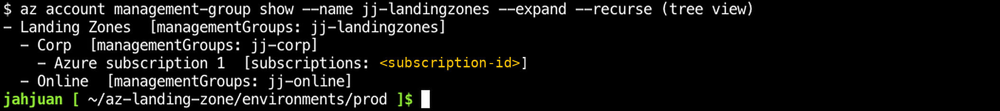
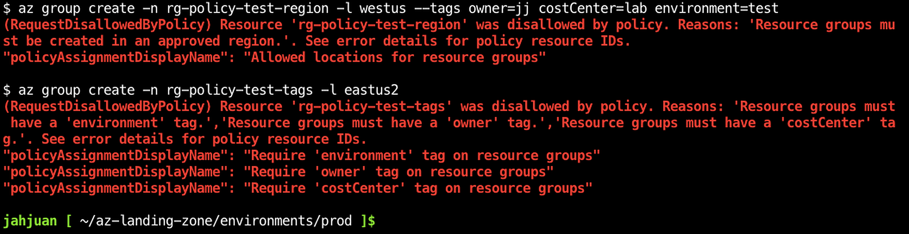
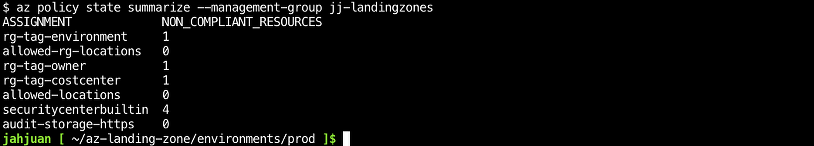
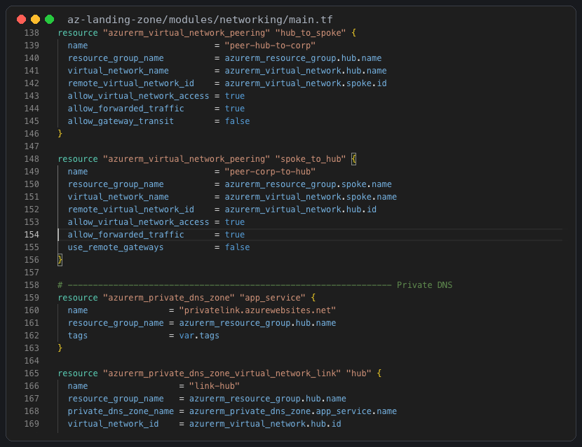
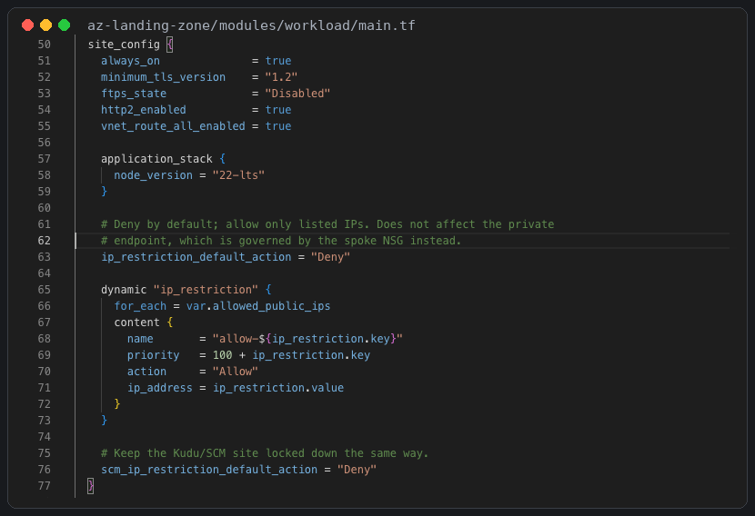
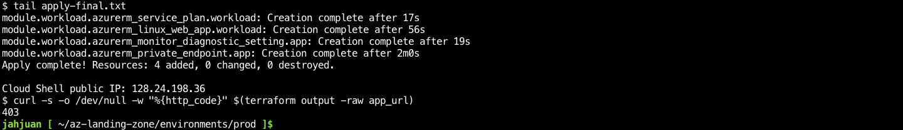
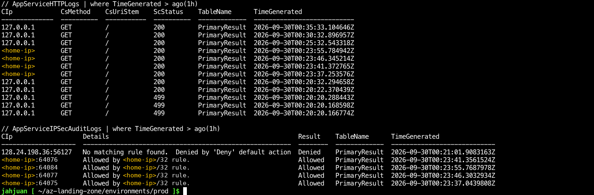

# Azure Landing Zone — Terraform

An enterprise-style Azure landing zone built with Terraform: a management group hierarchy, policy guardrails, hub-spoke networking with private DNS, central monitoring with a cost budget, a managed identity, and a real workload (App Service reachable through a private endpoint) running inside it.

It is small enough to deploy in a personal subscription for about a dollar a day, and each design choice has an Architecture Decision Record explaining why it was made over the alternatives.

## Architecture

```
Tenant Root Group
├── Platform
│   ├── Management     Log Analytics workspace, budget
│   ├── Connectivity   Hub VNet, private DNS
│   └── Identity       Managed identity
├── Landing Zones      ← Policy: allowed regions, required tags, audit
│   ├── Corp           ← lab subscription lives here
│   └── Online
└── Sandbox
```

```
           ┌─────────────── Hub VNet 10.0.0.0/22 ───────────────┐
           │ AzureFirewallSubnet · GatewaySubnet · snet-shared   │
           │ Private DNS: privatelink.azurewebsites.net          │
           └──────────────────────┬──────────────────────────────┘
                                  │ VNet peering
           ┌──────────── Corp spoke VNet 10.1.0.0/22 ────────────┐
           │ snet-private-endpoints ── PE ──► App Service (in)   │
           │ snet-app-integration   ◄──────── App Service (out)  │
           └─────────────────────────────────────────────────────┘
      All diagnostics ──► central Log Analytics workspace
```

## Modules

| Module | What it builds | AZ-305 domain |
|---|---|---|
| `management-groups` | 8-group hierarchy; places the subscription under Corp | Governance |
| `policy` | Allowed locations (resources + resource groups), required tags, audit example | Governance |
| `monitoring` | Log Analytics (1 GB/day cap), subscription budget with email alerts | Monitoring |
| `networking` | Hub-spoke, peering, NSG, private DNS zone linked to both VNets | Infrastructure |
| `identity` | User-assigned managed identity; Conditional Access template | Identity |
| `workload` | Linux App Service with VNet integration (outbound) and private endpoint (inbound) | Infrastructure |

## Proof it works

Deployed end to end from Azure Cloud Shell into a pay-as-you-go subscription (43 resources), then tested. The subscription ID and home IP are redacted.

### Governance

**Management group hierarchy.** The subscription lands under Corp, inside Landing Zones.



**Policy blocks non-compliant deployments.** A resource group in a disallowed region, and one missing the required tags, are both rejected with `RequestDisallowedByPolicy`.



**Compliance at management-group scope.** Policy state summarized across the Landing Zones management group.



### Networking and workload

**Hub-spoke peering and private DNS.** Peering in both directions, and a `privatelink.azurewebsites.net` zone linked to the VNets so the App Service resolves to its private endpoint.



**Deny-by-default access to the App Service.** Only listed IPs are allowed, and the Kudu/SCM site is locked down the same way.



**Deployed and enforced.** The final apply completes, and a request from an unlisted IP (Cloud Shell) gets `403`.



### Monitoring

**Allowed and denied traffic in Log Analytics.** App Service HTTP logs and IPSec audit logs show requests from the allowlisted IP succeeding and the Cloud Shell request denied by the default action.



## Decisions

| ADR | Decision |
|---|---|
| [01](docs/adr/01-governance.md) | Policy at management-group scope, built-in definitions |
| [02](docs/adr/02-network-topology.md) | Hub-spoke over Virtual WAN |
| [03](docs/adr/03-identity.md) | Managed identity + report-only-first Conditional Access, PIM |
| [04](docs/adr/04-compute.md) | App Service over Container Apps and AKS |
| [05](docs/adr/05-private-access.md) | Private endpoint over IP restrictions or service endpoints for inbound |

## Deploy

Full walkthrough from a new Azure account on a Mac: **[docs/LAB-GUIDE.md](docs/LAB-GUIDE.md)**.

Short version:

```bash
cd environments/prod
cp terraform.tfvars.example terraform.tfvars   # fill in your values
terraform init
terraform plan -out tfplan
terraform apply tfplan
# ... explore, test, screenshot ...
terraform destroy
```

## Cost

| Resource | Approx. cost |
|---|---|
| App Service plan B1 (Linux) | ~$0.018/hour |
| Private endpoint | ~$0.01/hour |
| Private DNS zone | ~$0.50/month |
| Log Analytics | first 5 GB/month free; capped at 1 GB/day |
| Management groups, policy, VNets, peering (low traffic), managed identity, budget | free or negligible |

Azure Firewall (~$1.25/hour) is included but commented out. Destroy the environment when you are not using it; everything rebuilds with one `apply`.

## CI

`.github/workflows/terraform.yml` runs `terraform fmt -check`, `terraform validate`, `terraform test`, `tflint` and a `checkov` security scan on every push and pull request. None of it needs Azure credentials.

`environments/prod/tests/plan.tftest.hcl` plans the full landing zone (43 resources) against a mock provider and checks naming conventions, that tags which would violate the landing zone's own policy are caught at plan time, and that invalid prefixes are rejected. Run it locally with `terraform test` from `environments/prod`.
